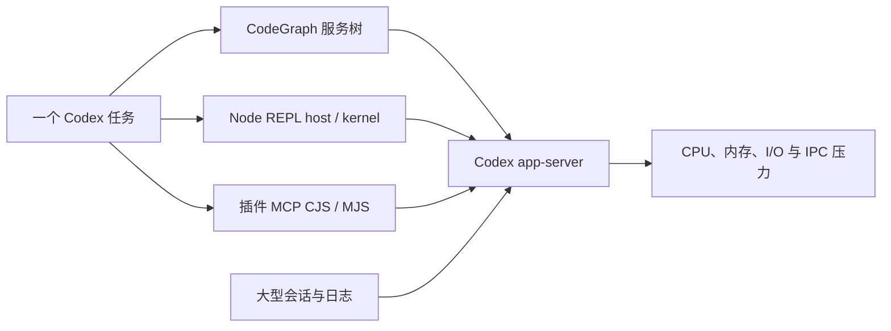

# Codex Desktop Windows 性能诊断与优化运行手册

> 状态日期：2026-07-16。本文记录一次真实的 Windows Codex Desktop 多任务卡顿调查、已经采用的本地优化、验证方法与回滚路径。它是一份可重复执行的运行手册，不代表已经修复 Codex 上游的进程生命周期问题。

## 先说结论

这次卡顿没有单一元凶。更接近事实的模型是：每个长期任务都会带起一组运行时服务，多个任务并行后，CodeGraph、Node REPL 和插件 MCP 的进程数与内存会一起放大；与此同时，Desktop `app-server` 还要持续处理大型会话、日志与进程通信。

本阶段采取的策略是保留真正有价值的能力，同时减少不必要的常驻服务和重复启动层：

- 保留 CodeGraph，但让 Node 直接带 `--liftoff-only` 启动，避免 CodeGraph 为补这个参数再自我重启一层。
- 保留 Node REPL，不修改它的运行逻辑；增强只读诊断，分清轻量 host、持久 kernel 与 bridge，避免把进程数量直接等同于泄漏。
- 保留 Sites、OpenAI Developers、Data Analytics 等 Skills，需要常驻进程的子 MCP 按实际用途关闭。
- 修复 BB Browser 全局 daemon，让不同项目复用同一个健康实例；项目第一次调用时仍能自动启动。
- 将 pre-compact hook 改为“首次最多读取尾部 16 MB，之后按 byte cursor 增量读取”，并在压缩后摘要卡片下增加横线。
- 写入 WSL2/Docker 的 8 GB、4 CPU 上限；该配置只有在安全关闭 Docker/WSL 后才会生效，单独重启 Codex 不会激活它。

仍未解决的是 Codex Desktop 对旧 stdio MCP、Node REPL 和插件运行时的上游回收策略。本仓库只做观察、缓解和证据采集，不会猜测任务归属后自动杀进程。

截至状态日期，各项进度如下：

| 项目 | 状态 |
| --- | --- |
| 不必要的插件子 MCP | 用户配置已关闭；完整重启 Codex 后验证新启动集合 |
| CodeGraph 直接传入 `--liftoff-only` | 配置和最小启动验证完成；旧 root 只有在完整退出 Codex 后才会全部消失 |
| Node REPL / stdio MCP 只读 health snapshot | 已实现并通过回归测试，不做自动清理 |
| pre-compact cursor 与摘要卡片横线 | 已实现并通过单元测试 |
| BB Browser 全局 daemon | 已修复，并验证跨工作目录复用 |
| Docker/WSL 8 GB、4 CPU 上限 | `.wslconfig` 已写入；仍需在有状态容器安全停止后重启 WSL 才会激活 |

## 为什么多个长期任务会放大卡顿



这里最重要的概念是“乘法效应”。一个 CodeGraph 根进程本身未必很重，一个空的 Node REPL host 也只有几 MB；但当十几个任务各自保留一套服务树，再叠加少数高内存 kernel，系统基线就会快速升高。

因此，判断时要区分三种情况：

1. **正常的并行成本**：服务根数量大致跟活跃任务数量一致。
2. **延迟回收**：任务关闭后，相关服务过了一段时间才减少。
3. **疑似遗漏回收**：任务已经关闭或 Codex 已退出，服务树仍长期存在，而且无法对应任何活跃任务。

本机曾观察到同类服务根从 19 组自行下降到 14 组，所以“客户端从不回收”这个说法过强。更准确的描述是：当前 Windows 客户端存在延迟或不完整回收，而且默认会为任务较早地启动整套服务。

## 2026-07-16 调查快照

以下数字是当时的案例证据，用于未来比较，不是固定阈值：

| 项目 | 当时观察值 |
| --- | ---: |
| Codex Desktop 包版本 | `26.707.12708.0` |
| 真正的 Desktop `app-server` | 1 个 |
| `app-server` private memory | 约 1.24 GB |
| 后代进程 | 104 个 |
| stdio/MCP 服务根 | 56 个 |
| CodeGraph | 14 个根、43 个进程、约 1.49 GB private memory |
| Node REPL | 14 个根、20 个进程、约 2.44 GB private memory |
| 插件 MCP CJS | 14 个根、约 353 MB private memory |
| 插件 MCP MJS | 14 个根、约 305 MB private memory |
| 服务树合计 | 约 4.59 GB private memory，不含 `app-server` |
| Node REPL host / 活跃 kernel | 14 / 3 |
| 最大单个 kernel | 约 2.22 GB private memory、累计约 2960 CPU 秒 |
| 活跃 session 存储 | 约 13.21 GB / 823 个文件 |
| `logs_2.sqlite` | 约 990 MB |

30 秒的 `app-server` OS 计数器样本还记录到约 237.7 MB 读取、36.5 MB 写入、41,433 次读操作与 5,703 次写操作。Windows 的该计数器同时包含文件、管道和网络 I/O，不能把它全部解释成磁盘读写，但足以说明卡顿不只是某一个 Node 子进程的问题。

## 每次先做只读诊断

不要先打开任务管理器逐个结束 Node。先在仓库根目录运行：

```powershell
powershell -NoProfile -ExecutionPolicy Bypass -File .\scripts\health-snapshot.ps1
```

需要保留可比较的 JSON 证据时：

```powershell
$stamp = Get-Date -Format "yyyyMMdd-HHmmss"
$target = Join-Path $env:TEMP "codex-health-$stamp.json"
powershell -NoProfile -ExecutionPolicy Bypass -File .\scripts\health-snapshot.ps1 -AsJson |
    Set-Content -LiteralPath $target -Encoding utf8
$target
```

重点看四块：

- `AggregateByKind`：每类服务有多少 root、进程和 private memory。
- `NodeRuntimes`：每个 Node REPL host 是否带 kernel，真正的大内存在哪一层。
- `RuntimeWarnings`：只表示“值得结合任务生命周期检查”，不等于可以安全清理。
- `BbBrowser`：注册 PID、daemon 端口、CDP 端口是否由预期进程持有。

快照固定返回 `ReadOnly=true` 与 `AutomaticCleanup=false`。它不启动、停止、挂起或修改进程，也不输出命令行和 daemon token。

### 建议的 PID 生命周期矩阵

遇到疑似旧 stdio MCP 没有回收时，按同一套检查点记录，而不是只截一张任务管理器图片：

| 检查点 | 操作 | 记录内容 | 如何解释 |
| --- | --- | --- | --- |
| T0 | 完整重启 Codex 后、打开任务前 | `app-server` PID、各类 root、内存 | 新会话基线 |
| T1 | 打开 N 个任务后 | 活跃任务数与各类 root 增量 | 判断是否按任务成组启动 |
| T2 | 关闭或归档部分任务后 | 立即、10、30、60 分钟的同一组数字 | 区分延迟回收与完全不回收 |
| T3 | 完整退出 Codex 后 | 是否仍有 CodeGraph、REPL 或插件 MCP | 除明确的全局 daemon 外，残留更接近 orphan 证据 |
| T4 | 再次启动 Codex | 新 `app-server` PID 与旧 PID 是否混在一起 | 检查跨重启残留 |

BB Browser daemon 是预期的独立全局服务，不应因为它出现在 `DetachedCandidates` 就把它当作 orphan。

## Skills 与 MCP 为什么要分开看

Skill 通常是一组按需读取的说明、脚本或模板；MCP 是通过 stdio 或端口运行的服务。保留一个 Skill，不等于必须让它的 MCP 在每个任务中常驻。

本次配置遵循以下原则：

| 能力 | 当前策略 | 原因 |
| --- | --- | --- |
| CodeGraph | 全局保留 | 结构化代码搜索、调用关系和影响分析确实能提升项目效率 |
| Node REPL | 保留 | 多工具编排和持久 JavaScript 状态需要它，但要观察 kernel |
| Sites Skills | 保留；`sites-design-picker` MCP 关闭 | 普通站点技能仍可用，不为设计选择器常驻一个服务 |
| OpenAI Developers Skills | 保留；`openai-api-key-local-confirmation` MCP 关闭 | 它只为“创建新 API key 时确认本地 env 文件写入位置”提供表单，并不是日常 API 调用所需的 key 服务 |
| Data Analytics Skills | 保留；`dataAnalyticsWidgets` MCP 关闭 | 该 MCP 用于渲染图表、表格、dashboard 和 report artifact；普通分析与脚本不依赖它 |
| 内置 Browser | 关闭 | 当前 Windows 运行时走已固定版本的 Codex Chrome/CDP 路径 |
| Codex Chrome | 保留 | 作为当前浏览器自动化入口 |
| 项目专用 MCP | 只在需要它的项目中启用 | 避免每个无关任务都复制一套服务 |

对应的用户配置覆盖形态如下。插件标识可能随版本变化，升级后应先核对安装清单，再沿用这些覆盖：

```toml
[plugins."openai-developers@openai-curated".mcp_servers.openai-api-key-local-confirmation]
enabled = false

[plugins."data-analytics@openai-curated-remote".mcp_servers.dataAnalyticsWidgets]
enabled = false

[plugins."sites@openai-bundled"]
enabled = true

[plugins."sites@openai-bundled".mcp_servers.sites-design-picker]
enabled = false

[plugins."chrome@openai-bundled"]
enabled = true

[plugins."browser@openai-bundled"]
enabled = false
```

`enabled=false` 不会卸载插件或删除 Skills，也不会保证当前已经运行的旧 stdio 进程马上退出。要验证启动集合是否改变，需要完整退出并重新打开 Codex，再运行 health snapshot。

## CodeGraph：直接传入 `--liftoff-only`

### 这项参数解决什么

CodeGraph 使用 tree-sitter 的大型 WebAssembly grammar。当前安装的 CodeGraph 1.4.1 为避免 Node 22/24 上 V8 优化编译层的 Zone OOM，会检查 Node 是否带 `--liftoff-only`。如果缺少，它会用这个参数再启动自己一次。

这次调整前的逻辑相当于：

```text
Codex -> node codegraph.js -> node --liftoff-only codegraph.js
```

调整后：

```text
Codex -> node --liftoff-only codegraph.js
```

`Liftoff` 是 V8 的 WebAssembly 基线编译器。该参数让 WebAssembly 不再进入更重的优化编译层。代价是放弃一部分理论上的 WASM 优化速度；收益是避开已知的编译崩溃，并省掉每个 CodeGraph root 的一次自我重启与中间父进程。

这不是关闭 CodeGraph，也不会取消索引、watcher、daemon 或 MCP 能力。

### 可移植的配置方式

先发现当前 Node 和全局 CodeGraph 入口，不要复制另一台机器的绝对路径：

```powershell
$node = (Get-Command node -ErrorAction Stop).Source
$globalRoot = (npm root -g).Trim()
$codegraph = Join-Path $globalRoot "@colbymchenry\codegraph\dist\bin\codegraph.js"
$node
$codegraph
Test-Path -LiteralPath $codegraph
```

确认当前 Node 仍支持该参数，并确认 CodeGraph 能启动：

```powershell
node --v8-options | Select-String -Pattern "liftoff-only"
node --liftoff-only $codegraph --version
```

在 `%USERPROFILE%\.codex\config.toml` 中，形态应为：

```toml
[mcp_servers.codegraph]
command = 'C:\Path\To\node.exe'
args = ["--liftoff-only", 'C:\Path\To\node_modules\@colbymchenry\codegraph\dist\bin\codegraph.js', "serve", "--mcp"]
```

改动后必须完整退出并重新启动 Codex。只修改文件不会改变已经运行的 CodeGraph root。

为了确认新进程都直接带参数，又不把完整命令行写进报告，可在本机运行：

```powershell
Get-CimInstance Win32_Process -Filter "Name='node.exe'" |
    Where-Object { $_.CommandLine -match 'codegraph(?:\.js)?' } |
    ForEach-Object {
        [pscustomobject]@{
            ProcessId = $_.ProcessId
            HasLiftoffOnly = [bool]($_.CommandLine -match '(?:^|\s)--liftoff-only(?:\s|$)')
        }
    }
```

### CodeGraph 或 Node 更新后怎么判断是否保留

每次“Skills 与服务升级”后做四项检查：

1. 记录 `node --version` 与 `npm list -g @colbymchenry/codegraph --depth=0`。
2. 运行 `node --v8-options | Select-String liftoff-only`。如果 Node 已不再接受该参数，先停止升级后的自动启动，不能带着无效配置硬开 Codex。
3. 在安装后的 CodeGraph 入口与 `wasm-runtime-flags` 文件中搜索 `liftoff-only` 和 relaunch 逻辑。
4. 用 `node --liftoff-only $codegraph --version` 做最小启动验证，再完整重启 Codex，并运行 health snapshot。

如果新版 CodeGraph 不再需要自我 relaunch，或者 Node/V8 已移除该参数，就从 `args` 第一项删除 `"--liftoff-only"`，恢复为普通入口后重新验证。不要因为旧文档存在就永久保留一个已经失效的 V8 flag。

### 回滚

修改前先备份：

```powershell
$config = Join-Path $env:USERPROFILE ".codex\config.toml"
$backupDir = Join-Path $env:USERPROFILE ".codex\backups"
$stamp = Get-Date -Format "yyyyMMdd-HHmmss"
New-Item -ItemType Directory -Path $backupDir -Force | Out-Null
Copy-Item -LiteralPath $config -Destination (Join-Path $backupDir "config.toml.before-codegraph-$stamp.bak")
```

本次机器还保留了 `config.toml.before-codegraph-liftoff-20260716T174700.bak`。回滚时可以恢复备份，或只删除 CodeGraph `args` 中的第一项 `"--liftoff-only"`；随后完整重启 Codex，并复测。

## Node REPL：改的是识别方式，不是运行时

“Node REPL 优化”容易被误解。这次没有修改 `node_repl.exe`、`kernel.js` 的执行逻辑，也没有添加自动清理。修改发生在 `scripts\health-snapshot.ps1` 的诊断模型中。

现在把一个 REPL 运行时拆成三种角色：

| 角色 | 含义 | 常见资源特征 |
| --- | --- | --- |
| `node-repl-host` | 每个任务与工具接口的轻量宿主 | 通常只有几 MB；进程多不代表内存一定高 |
| `node-kernel` | 执行 JavaScript、保留 import、对象、连接与状态的持久内核 | 真正可能增长到数百 MB 或数 GB |
| `codex-bridge` | host/kernel 与 Codex 之间的轻量桥接进程 | 不应被误判成第二个顶层 `app-server` |

为什么要这样分？如果只看到 14 个 `node_repl.exe`，很容易得出“14 个都在大量吃内存”的错误结论。案例中有 14 个 host，但只有 3 个活跃 kernel，最大 kernel 占了约 2.22 GB。优化重点应放在持久 kernel 的状态、导入内容和任务生命周期，而不是批量结束所有小 host。

当前只读告警阈值：

| 信号 | 阈值 | 含义 |
| --- | ---: | --- |
| kernel private memory warning | 750 MB | 建议检查该任务最近执行了什么 |
| kernel private memory critical | 1024 MB | 高优先级检查，但仍不自动结束 |
| 空 host 年龄 | 60 分钟 | 与任务是否仍活跃交叉核对 |
| 服务 root 年龄 | 6 小时 | 生命周期复核候选 |
| 同类服务 root 数量 | 8 | 只表示数量较高，要同时看活跃任务数 |

kernel 内存也可能在垃圾回收前后明显波动。一次观察中，同一 kernel 曾从约 408 MB 上升到 2.22 GB；单张快照不能证明持续泄漏，至少要在 T1/T2/T3 多个检查点比较。

验证诊断脚本：

```powershell
powershell -NoProfile -ExecutionPolicy Bypass -File .\tests\health-snapshot-regression.ps1
```

## Pre-compact hook：全量扫描改成 cursor 增量

长任务压缩前会保存一张本地 context card。旧思路如果每次重新扫描整个 JSONL，会让越大的会话越慢。当前 `%USERPROFILE%\.codex\tools\context_compaction_card.py` 使用以下算法：

1. 首次发现 transcript 时，小文件从头读；大文件只从尾部最多 16 MB 开始。
2. 将文件身份、byte cursor、最近消息和计数保存在 `%USERPROFILE%\.codex\context-cards\.state`。
3. 后续只读取 cursor 之后新增的完整 JSONL 记录；遇到最后一行尚未写完时不推进 cursor。
4. 文件被替换、截断或身份改变时，旧 cursor 失效并重新建立安全状态。
5. hook 只读本地 transcript，不调用第二个模型，不访问网络；失败时 fail-open，不阻断 Codex 原生压缩。

压缩后的第一条用户可见回复会先输出 `## 压缩后摘要卡片`，卡片结束后输出独立的 Markdown 横线：

```markdown
## 压缩后摘要卡片

- ...

---

这里开始新的正文。
```

横线只负责视觉分隔，不参与上下文恢复逻辑。

更新 Codex 或 hook 后运行：

```powershell
python "$env:USERPROFILE\.codex\tools\tests\test_context_compaction_card.py"
```

如果新版 Codex 改变 hook payload 或 transcript 格式，先停用 `%USERPROFILE%\.codex\hooks.json` 中对应的 `PreCompact` 与 `SessionStart` compact 条目，再修复测试；不要让辅助卡片阻断原生压缩。回滚脚本时，应保留现有 context card，删除或移动它们不属于必要回滚步骤。

## BB Browser：一个用户级 daemon，多项目复用

BB Browser 不需要每个项目各起一个 daemon。它的 CLI 会检查全局注册信息、daemon 端口与 Chrome CDP：

- daemon 和 CDP 都健康时，直接复用现有实例。
- daemon 不存在时，第一次 BB 命令会自动启动。
- daemon 存在但 CDP 断开时，CLI 会停止坏实例并启动新的 detached daemon。

本次已在两个不同工作目录验证它们复用同一个 daemon PID。修复顺序是：

```powershell
bb-browser daemon status
bb-browser daemon stop
bb-browser tab --json
```

第三条命令既是测试，也是按需启动入口。之后运行 health snapshot，确认 `Registered=true`、端口 owner 匹配且 `Healthy=true`。

如果环境使用 Codex Chrome 插件，更新 Codex 后先检查浏览器兼容门：

```powershell
python "$env:USERPROFILE\.codex\tools\browser_runtime_gate.py" --check
```

只有检查失败时才运行同一命令的 `--apply`，然后再次 `--check`。这套环境保持 Browser Use/IAB 关闭，使用固定版本的 Codex Chrome/CDP；不要为了修 BB daemon 同时重新启用另一套浏览器运行时。

BB daemon 修复立即生效，不要求重启 Codex。daemon 将来退出也不代表所有项目失去 BB 能力，下一次 BB 命令会重新建立它。

## Docker Desktop / WSL2：限制整台虚拟机的上限

NestJS 等 Web Application 放在 Docker 里运行时，Docker Desktop 的 WSL2 VM 会与 Codex、浏览器和 Windows 本身争用资源。本机有约 32 GB 内存和 16 个逻辑处理器，因此选择“Windows 流畅优先”：

```ini
[wsl2]
memory=8GB
processors=4
swap=2GB

[experimental]
autoMemoryReclaim=dropCache
```

文件位置是 `%USERPROFILE%\.wslconfig`。这里限制的是整个 WSL2 VM，不是单个容器；其他 WSL2 发行版也会受到影响。容器 build 可能更慢，但为 Windows、Codex 和多个长期任务保留了更稳定的资源余量。

### 为什么重启 Codex 后还没生效

`.wslconfig` 只在 WSL2 VM 下一次启动时读取。2026-07-16 的回读仍显示 Docker 可见约 15.52 GiB 内存和 16 CPU，说明当时只写入了配置，还没有安全关闭 WSL。机器上有正在运行的 PostgreSQL、Redis 等有状态容器，因此没有强行执行 `wsl --shutdown`。

### 安全激活

先确认本地数据库没有写入任务，再在各 Compose 项目目录中执行 `docker compose stop`。退出 Docker Desktop 后运行：

```powershell
wsl --shutdown
```

重新启动 Docker Desktop，验证：

```powershell
$info = docker info --format '{{json .}}' | ConvertFrom-Json
"{0} CPU, {1:N2} GiB" -f $info.NCPU, ($info.MemTotal / 1GB)
```

预期接近 4 CPU 和 8 GiB。若仍是 16 CPU、约 15.5 GiB，说明 WSL VM 没有完成重启或配置未被读取。

Resource Saver 只有在没有容器运行时才能真正让 VM 进入节能状态。带 `restart: unless-stopped` 的容器会自动启动，并可能一直阻止空闲回收。

### 回滚或调整

先备份 `%USERPROFILE%\.wslconfig`，再改大数值，或把文件重命名为 `.wslconfig.disabled`。同样需要在确认有状态容器安全停止后执行 `wsl --shutdown`。不要在数据库写入、build 或另一个 WSL 任务运行时强制关闭。

参考：[Microsoft WSL 高级配置](https://learn.microsoft.com/windows/wsl/wsl-config)、[Docker Desktop WSL 2 后端](https://docs.docker.com/desktop/features/wsl/) 与 [Docker Resource Saver](https://docs.docker.com/desktop/use-desktop/resource-saver/)。

## 哪些修改需要重启

| 修改 | 生效方式 |
| --- | --- |
| 插件/MCP `enabled` 覆盖 | 完整退出并重新打开 Codex，旧 stdio 进程不会因改文件自动消失 |
| CodeGraph `--liftoff-only` | 完整重启 Codex，确保所有新 root 都按新命令启动 |
| health snapshot 诊断脚本 | 保存后立即生效，不需要重启 |
| pre-compact hook 代码 | 下一次 hook 调用读取新脚本；改变 hook 注册时建议重启 Codex |
| BB Browser daemon 修复 | 立即生效；下一次 BB 命令也能自动启动 |
| `.wslconfig` | 必须安全停止 Docker/WSL，并让 WSL2 VM 完整重启 |

不要在一个活跃 Codex 任务内部运行带 `-Force` 的 launcher；它会结束当前任务。

## 每次 Codex、Node、CodeGraph、Skill 或服务升级后的检查表

1. 记录 Codex Desktop、Node、CodeGraph、BB Browser 和 Docker 的版本。
2. 检查用户 `config.toml` 中的 MCP 子服务覆盖是否仍匹配新的插件标识。
3. 运行 context card 单元测试与 health snapshot 回归测试。
4. 完整重启 Codex，记录 T0 快照；打开少量任务后记录 T1。
5. 确认 CodeGraph 新进程都带 `--liftoff-only`，且 `node --liftoff-only ... --version` 正常。
6. 从任意项目目录运行 `bb-browser tab --json`，确认复用或自动恢复全局 daemon。
7. 关闭一个测试任务，按 T2 观察 10、30、60 分钟，记录旧 stdio root 是否减少。
8. 若更新了 WSL、Docker Desktop 或 `.wslconfig`，在安全窗口验证 CPU/内存上限。
9. 只有在能够把 PID、父子关系、时间点和任务动作对应起来时，才把残留报告为生命周期问题。

## 上游问题与本仓库边界

相关证据已提交到 [OpenAI Codex issue #30408](https://github.com/openai/codex/issues/30408)，并补充了本机从 19 组降到 14 组的观察，避免把问题表述成“永不回收”。[初始报告](https://github.com/openai/codex/issues/30408#issuecomment-4995079100) 与 [后续证据](https://github.com/openai/codex/issues/30408#issuecomment-4996986069) 可用于未来版本复测。

期望的上游能力包括：

- 为任务/runtime 提供稳定 owner ID。
- owner 关闭、归档、淘汰或卸载时，关闭 stdio transport 和完整 Windows 进程树。
- 全局/插件 MCP 按需启动，并支持空闲淘汰。
- 确实遵守子服务的 `enabled=false`。
- 为 Node REPL 提供 reset、idle 或显式生命周期接口。

在这些能力出现前，本仓库坚持只读诊断和人工确认。自动按年龄杀 Node、CodeGraph 或 MCP 很容易误伤仍在运行的长期任务，也可能中断数据库操作、浏览器会话或未保存的工具状态。
